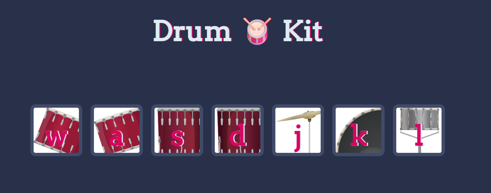

# Drum Kit 🥁

An interactive Drum Kit web app that lets users play drum sounds using keyboard keys or mouse clicks. Built using HTML, CSS, and JavaScript.

---

## Features

- Play drum sounds by clicking buttons or pressing keys
- Responsive design for all screen sizes
- Fun animations when a drum is played

---

## How to Run

1. Clone the repository:

```bash
git clone https://github.com/Chakriuppu/drum-kit.git

## Usage

Once the Drum Kit is running in your browser:

### Keyboard Controls
Press the following keys to play each drum:

| Key | Drum Sound       |
|-----|-----------------|
| w   | Tom 1           |
| a   | Tom 2           |
| s   | Tom 3           |
| d   | Tom 4           |
| j   | Snare           |
| k   | Crash Cymbal    |
| l   | Kick Drum       |

### Mouse Controls
- Click any of the drum buttons on the screen to play the corresponding drum sound.

### Visual Feedback
- Each drum button will show an animation when pressed, giving real-time feedback.

---

**Tip:** Try pressing multiple keys quickly to create your own drum patterns! 🥁

## Technologies

- **HTML5** – For the structure and layout of the drum kit.
- **CSS3** – For styling the buttons, animations, and overall design.
- **JavaScript (Vanilla)** – For handling user input (keyboard and mouse) and playing drum sounds.
## Live Demo

[Try it online](https://chakriuppu.github.io/drum-kit/)

> The live demo is hosted using GitHub Pages. Click the link above to play the Drum Kit directly in your browser.
